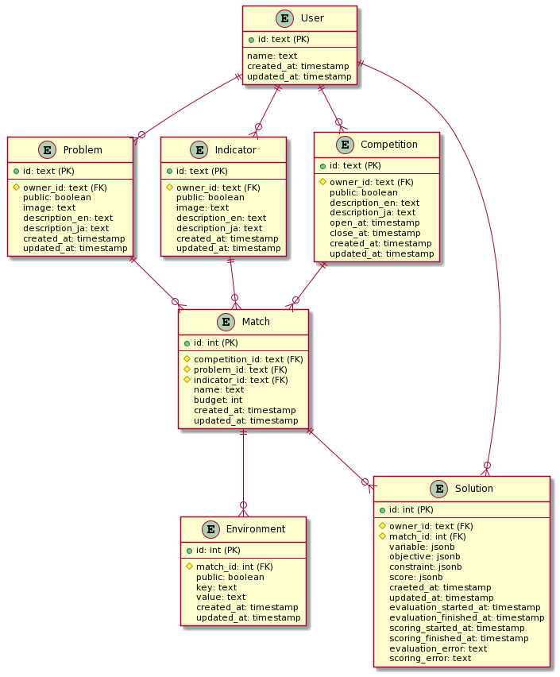

What is OptHub?
===============================

OptHub is a collaborative platform to run optimization competitions.

Concepts
--------

Community-based
^^^^^^^^^^^^^^^

Anyone can add new problems and indicators and share with others.

Web API based
^^^^^^^^^^^^^

Every operation is done via GraphQL API.

Virtualized
^^^^^^^^^^^

To enable users to implement their contribution in their preferred programming languages and middleware, OptHub uses Docker to wrap runtime environments.

Entities
--------

The following figure shows entities on OptHub.

User
^^^^

``User`` represents a user account.

Problem
^^^^^^^

``Problem`` represents a problem function such as sphere and rasgrigin to evaluate a solution.

Indicator
^^^^^^^^^

``Indicator`` represents an indicator function such as hypervolume to score a set of solutions.

Competition
^^^^^^^^^^^

``Competition`` represents a competition consists of one or more matches.

Match
^^^^^

``Match`` represents a match held in a competition.

Environment
^^^^^^^^^^^

``Environment`` represents an environmental variable that configures docker containers of ``Problem`` and ``Indicator``.

Solution
^^^^^^^^

``Solution`` represents a solution submitted to a ``Match``.

Progress
^^^^^^^^

``Progress`` represents the progress of a ``Match`` for  a ``User``.

OptHub API
----------

OptHub provides GraphQL API that enables us to operate OptHub entities.

OptHub CLI
----------

OptHub CLI issues GraphQL queries and mutations in a human-friendly way.

References
----------
